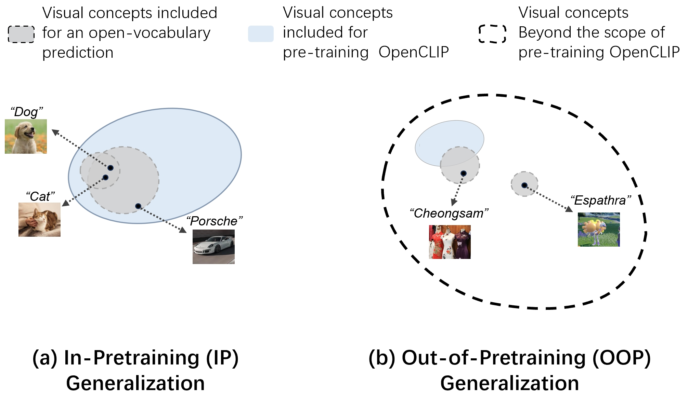
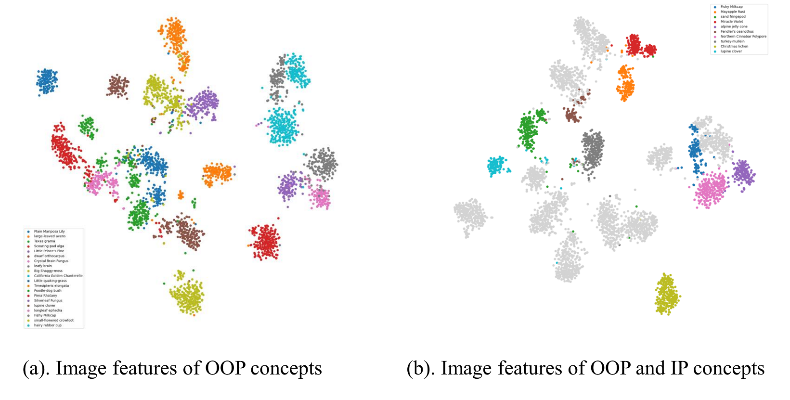
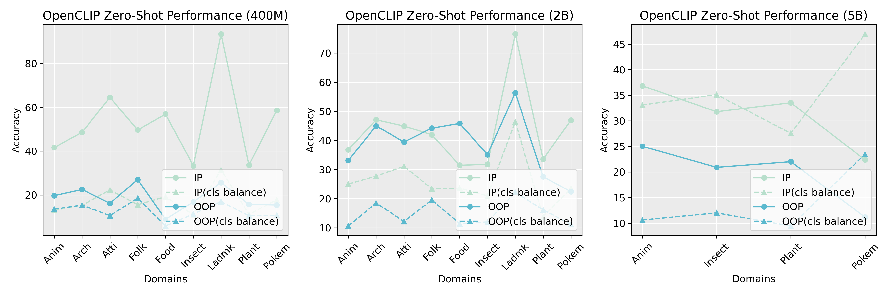
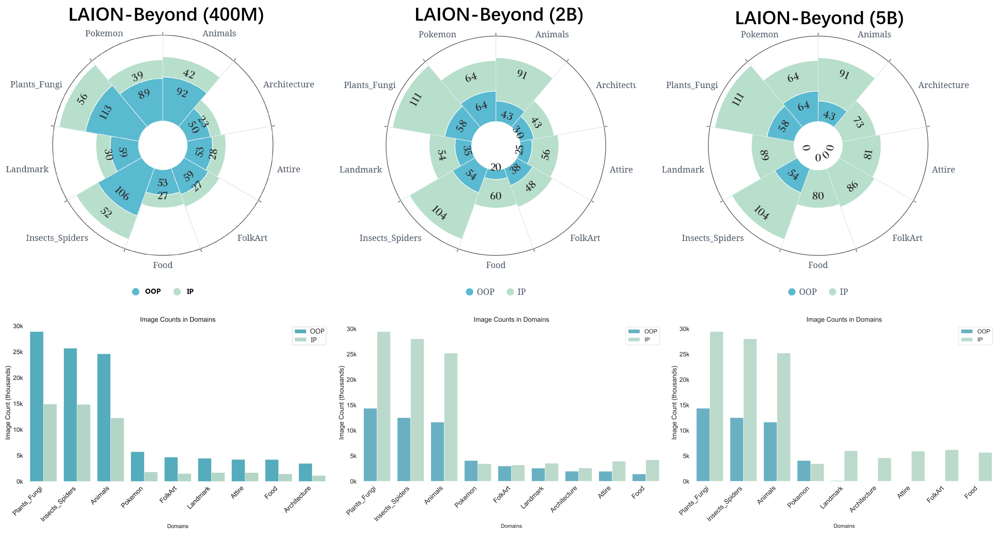
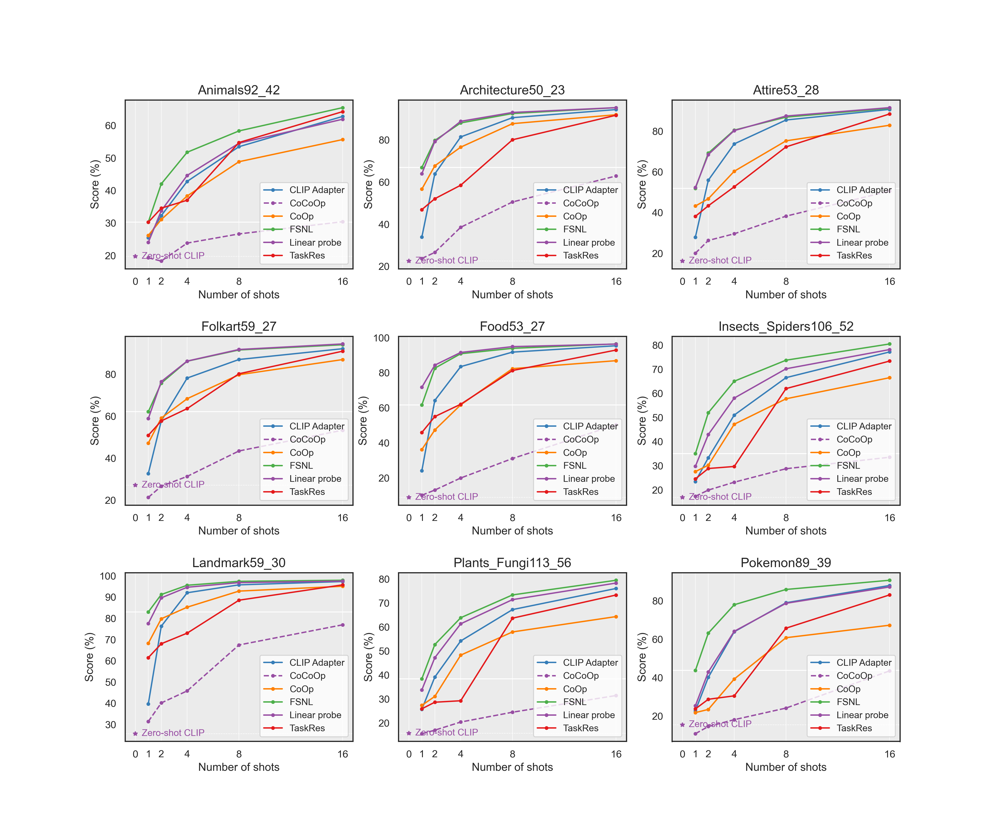
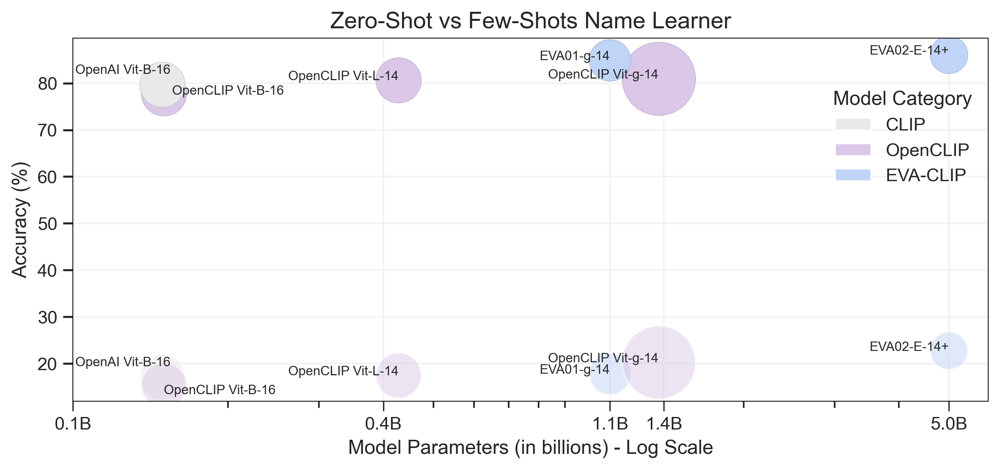

# FSNL: Few-Shot Name Learning

This is the official code release for our CVPR 2025 paper:

> **Reproducible Vision-Language Models Meet Concepts Out of Pre-Training**  
> CVPR 2025  
> [[Paper]](https://openaccess.thecvf.com/content/CVPR2025/papers/Chen_Reproducible_Vision-Language_Models_Meet_Concepts_Out_of_Pre-Training_CVPR_2025_paper.pdf) | [[Project Page]](https://m-huangx.github.io/laion_beyond/) | [[HuggingFace Dataset]](https://huggingface.co/datasets/MHuangX/LAION-Beyond) | [[Code]](https://github.com/M-HuangX/LAION-Beyond)


---

## Overview

FSNL (Few-Shot Name Learning) is a prompt-learning method for CLIP/OpenCLIP that learns **per-class name embeddings** directly instead of shared context vectors (as in CoOp). Given only a handful of labeled images per class, FSNL optimizes a small set of token-level embeddings that replace each class name in the text prompt, while keeping all CLIP weights frozen.

We also introduce the **LAION-Beyond** benchmark — a collection of nine fine-grained datasets covering concepts absent from LAION-400M pre-training data — to evaluate out-of-pretraining (OOP) generalization.

<p align="center">
  
  <br>
  <em>Figure 1: Comparison between IP and OOP generalization. The former evaluates OpenCLIP's generalization with visual concepts seen in pre-training phases, whereas the latter justifies its generalization through the concepts absent during pre-training.</em>
</p>

---

## Key Findings

**1. Strong image feature representation for OOP concepts.** OpenCLIP's image encoder forms well-separated clusters for OOP concepts (clustering accuracy gap < 3% on most domains vs. IP concepts).

<p align="center">
  
  <br>
  <em>Figure 3: t-SNE visualization of image features for OOP (Plants & Fungi) and mixed OOP/IP classes.</em>
</p>

**2. Image-text alignment failure.** Despite strong image features, zero-shot transfer on OOP concepts fails significantly — the token embeddings for OOP class names were never aligned with visual features during pre-training. This gap persists even as pre-training data scales from 400M to 5B.

<p align="center">
  
  <br>
  <em>Figure 4a: OpenCLIP's zero-shot accuracy on OOP vs. IP classes in LAION-Beyond.</em>
</p>

**3. Name-tuning is the key.** Our FSNL and ZSNL algorithms, which fine-tune only the name (token) embeddings of OOP concepts, efficiently restore OOP generalization without degrading IP performance.

---

## The LAION-Beyond Benchmark

<p align="center">
  
  <br>
  <em>Figure 2a: Statistics of OOP and IP concepts and images in LAION-Beyond (400M), (2B), and (5B).</em>
</p>

LAION-Beyond is a multi-domain benchmark for evaluating OOP concept generalization of vision-language models.

| Split | Images | Concepts |
|-------|--------|----------|
| OOP   | 106,052 | 674 |
| IP    | 51,330  | 324 |
| **Total** | **157,382** | **998** |

Included datasets:
`Pokemon`, `Animals`, `Architecture50_23`, `Attire54_28`, `FolkArt59_27`, `Food53_27`, `Insects_Spiders106_52`, `Landmark59_30`, `Plants_Fugi113_56`

Each dataset comes with `*_OOP` (Out-of-Pretraining) and `*_IP` (In-Pretraining) subdirectories. Download and place them under the same root directory. The dataset loader auto-discovers the correct subdirectory via glob pattern matching.

Each dataset directory should contain:
```
<DatasetName>_OOP/
    images/
        <classname>/
            *.jpg
    split_Xin_<name>.json
<DatasetName>_IP/
    images/
        ...
    split_Xin_<name>.json
```

> **Dataset:** [[HuggingFace]](https://huggingface.co/datasets/MHuangX/LAION-Beyond)

---

## Experimental Results

### OOP Few-Shot Learning (4-shot, H-mean of OOP & IP accuracy)

<p align="center">
  
  <br>
  <em>Figure 5: OOP few-shot learning performance (1,2,4,8,16 shots) of different methods across domains in LAION-Beyond (400M).</em>
</p>

| Method | Animals | Architecture | Attire | FolkArt | Food | Insects | Landmark | Plants | Pokemon | Avg |
|--------|---------|--------------|--------|---------|------|---------|---------|--------|---------|-----|
| OpenCLIP | 26.75 | 30.75 | 25.88 | 35.04 | 15.36 | 22.38 | 40.25 | 21.43 | 24.48 | 26.92 |
| CoOp | 31.37 | 57.80 | 50.39 | 52.06 | 42.55 | 25.73 | 85.89 | 24.78 | 35.52 | 45.12 |
| CLIP-Adapter | 38.98 | 59.27 | 64.56 | 56.32 | 64.32 | 32.51 | 90.82 | 31.97 | 54.99 | 54.86 |
| **FSNL (ours)** | **46.17** | **62.63** | **71.65** | **63.03** | **70.00** | **44.03** | **94.48** | **44.12** | **68.87** | **62.55** |

### Performance Across Model Scales

<p align="center">
  
  <br>
  <em>Figure 6: FSNL performance under neural scaling law. Light circles = zero-shot baselines; dark circles = after FSNL tuning.</em>
</p>

FSNL demonstrates consistent improvements across different model scales (ViT-B/16, ViT-L/14) and CLIP variants (OpenAI CLIP, OpenCLIP, EVA-CLIP 2B).

---

## Installation

**1. Clone the repository**

```bash
git clone https://github.com/M-HuangX/LAION-Beyond.git
cd FSNL
```

**2. Install dependencies**

```bash
pip install torch torchvision
pip install open_clip_torch ftfy regex tqdm scikit-learn
```

Install [Dassl](https://github.com/KaiyangZhou/Dassl.pytorch) (modified version included at `../Dassl.pytorch/`):

```bash
cd ../Dassl.pytorch
pip install -e .
cd ../FSNL
```

---

## Running Experiments

All experiments go through `train.py`.

### Training FSNL

```bash
python train.py \
  --root /path/to/datasets \
  --seed 1 \
  --trainer FSNL_openclip \
  --dataset-config-file configs/datasets/Animals92_42.yaml \
  --config-file configs/trainers/FSNL_openclip/vit_b16_ep100.yaml \
  --output-dir output/fsnl_animals_4shot \
  TRAINER.FSNL.FLE False \
  TRAINER.FSNL.N_CTX 4 \
  TRAINER.FSNL.CIFC True \
  TRAINER.FSNL.USE_CAPTION True \
  DATASET.NUM_SHOTS 4 \
  DATASET.SUB_CLASSES OOP
```

### Evaluation Only

```bash
python train.py \
  --root /path/to/datasets \
  --seed 1 \
  --trainer FSNL_openclip \
  --dataset-config-file configs/datasets/Animals92_42.yaml \
  --config-file configs/trainers/FSNL_openclip/vit_b16_ep100.yaml \
  --output-dir output/eval \
  --model-dir output/fsnl_animals_4shot \
  --load-epoch 100 \
  --eval-only \
  DATASET.NUM_SHOTS 4 \
  DATASET.SUB_CLASSES OOP
```

### Linear Probe Baseline

```bash
# Step 1: Extract CLIP features
python lpclip/feat_extractor.py --dataset Animals92_42 --root /path/to/datasets

# Step 2: Run linear probe
python lpclip/linear_probe.py --dataset Animals92_42 --feature_dir clip_feat
```

---

## Key Configuration Flags

| Flag | Default | Description |
|------|---------|-------------|
| `TRAINER.FSNL.FLE` | `False` | Fixed-length embedding. `False` = match original BPE token count per class |
| `TRAINER.FSNL.N_CTX` | `4` | Token count when `FLE=True` |
| `TRAINER.FSNL.CIFC` | `True` | Initialize from CLIP token embeddings (`True`) or random (`False`) |
| `TRAINER.FSNL.USE_CAPTION` | `True` | Enable caption-based contrastive loss alongside the base loss |
| `DATASET.NUM_SHOTS` | — | Number of training images per class (e.g., 1, 2, 4, 8, 16) |
| `DATASET.SUB_CLASSES` | `OOP` | Which split to use: `OOP`, `IP`, or `All` |

---

## Available Trainers

| Trainer name | Description |
|---|---|
| `FSNL_openclip` | **Ours**: per-class name embedding learning with OpenCLIP ViT-B/16 |
| `FSNL_openclip_2B` | FSNL with EVA-CLIP 2B backbone |
| `FSNL_openclip_400M_L14` | FSNL with OpenCLIP ViT-L/14 (400M) |
| `CoOp_openclip` | CoOp baseline with OpenCLIP |
| `CoCoOp_openclip` | CoCoOp baseline with OpenCLIP |
| `ZeroshotCLIP2_openclip` | Zero-shot evaluation baseline |
| `CoOp` / `CoCoOp` | Original CoOp/CoCoOp with OpenAI CLIP |

---

## GCD Experiments (Supplementary)

Generalized Category Discovery (GCD) experiments from the supplementary material use `FSNL_openclip_GCD` trainer and the `LAION_Beyond_GCD` dataset. Scripts are in `scripts/FSNL_openclip_GCD/`.

---

## Citation

If you use this code or the LAION-Beyond benchmark in your research, please cite:

```bibtex
@InProceedings{chen2025laionbeyond,
    author    = {Chen, Ziliang and Huang, Xin and Fan, Xiaoxuan and Wang, Keze and Zhou, Yuyu and Guan, Quanlong and Lin, Liang},
    title     = {Reproducible Vision-Language Models Meet Concepts Out of Pre-Training},
    booktitle = {Proceedings of the IEEE/CVF Conference on Computer Vision and Pattern Recognition (CVPR)},
    year      = {2025}
}
```

---

## Acknowledgements

This codebase is built on [Dassl](https://github.com/KaiyangZhou/Dassl.pytorch) and [CoOp](https://github.com/KaiyangZhou/CoOp). We thank the authors for their open-source contributions.
